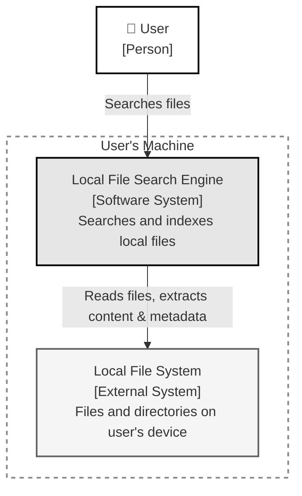
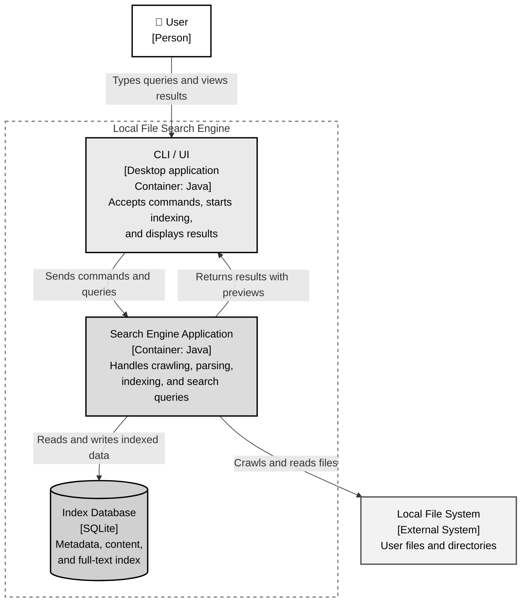
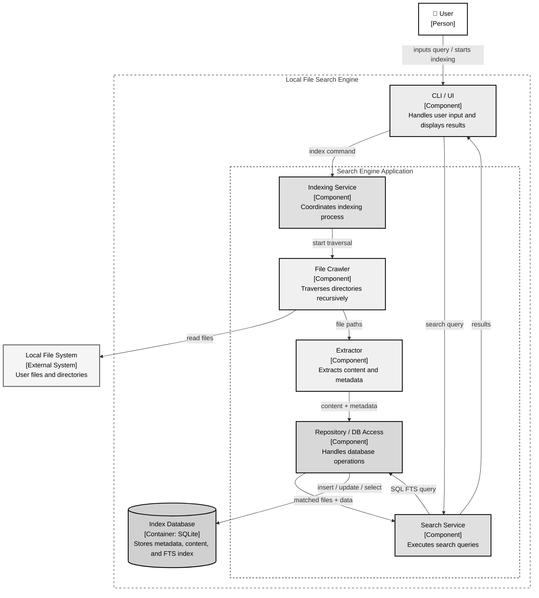

# Local File Search Engine — Architecture

This document describes the architecture of the Local File Search Engine, a desktop application that indexes and searches files on the user's local machine by file name, content, and metadata. The architecture follows the **C4 model** (Context, Containers, Components, Code), providing progressively detailed views of the system.

---

## 1. System Context (C4 Level 1)

The system context diagram shows the highest-level view: who uses the system and what external systems it depends on.

- **User** — Initiates file searches and indexing operations through the application interface.
- **Local File Search Engine** — The software system that crawls, indexes, and searches local files, returning relevant results to the user.
- **Local File System** — The external system (OS file system) from which the engine reads files, extracts content, and collects metadata.

### Interactions

| Source | Target | Description |
|--------|--------|-------------|
| User | Local File Search Engine | Submits search queries and triggers indexing |
| Local File Search Engine | Local File System | Crawls directories, reads file content and metadata |

---

## 2. Containers (C4 Level 2)

The container diagram zooms into the Local File Search Engine and reveals its major deployable/runnable units.

- **CLI / UI** — The interface between the user and the system. It accepts commands (index, search), displays ranked results with contextual previews, and delegates work to the core application.
- **Search Engine Application** — The central Java application responsible for orchestrating crawling, parsing, indexing, and query execution. It acts as the bridge between the user interface, the file system, and the database.
- **Index Database (SQLite)** — A lightweight relational database that stores file metadata, extracted content, and a full-text search (FTS) index, enabling fast query processing without the overhead of a standalone database server.

### Interactions

| Source | Target | Description |
|--------|--------|-------------|
| User | CLI / UI | Types queries and views search results |
| CLI / UI | Search Engine Application | Forwards commands and search queries |
| Search Engine Application | Index Database | Reads and writes indexed file records |
| Search Engine Application | Local File System | Crawls directories and reads files |
| Search Engine Application | CLI / UI | Returns ranked results with previews |

---

## 3. Components (C4 Level 3)

The component diagram expands the **Search Engine Application** container, showing its internal building blocks and their responsibilities.

- **Indexing Service** — Coordinates the full indexing pipeline. It initiates crawling, routes discovered files to the extractor, and manages the overall indexing workflow.
- **File Crawler** — Recursively traverses the file system starting from a configured root directory. It discovers files and directories, handling edge cases such as symbolic link loops and permission errors.
- **Extractor** — Identifies file types and extracts relevant content and metadata (file size, timestamps, text content). It uses format-specific strategies to handle different file types appropriately.
- **Search Service** — Receives search queries from the UI, constructs and executes SQL FTS queries against the database, and assembles ranked result sets for display.
- **Repository / DB Access** — Encapsulates all database operations (insert, update, select). It provides a clean data access layer, isolating the rest of the application from SQL and schema details.

### Interactions

| Source | Target | Description |
|--------|--------|-------------|
| User | CLI / UI | Inputs search queries or triggers indexing |
| CLI / UI | Indexing Service | Sends index commands |
| CLI / UI | Search Service | Forwards search queries |
| Indexing Service | File Crawler | Initiates recursive directory traversal |
| File Crawler | Local File System | Reads files and directories |
| File Crawler | Extractor | Passes discovered file paths for processing |
| Extractor | Repository / DB Access | Sends extracted content and metadata for storage |
| Search Service | Repository / DB Access | Submits FTS queries |
| Repository / DB Access | Search Service | Returns matching file records |
| Repository / DB Access | Index Database | Executes SQL operations (insert, update, select) |
| Search Service | CLI / UI | Returns ranked search results |

---

## 4. Code (C4 Level 4)

The code-level diagram will detail the class structure of each component, including key classes, interfaces, and their relationships. This section will be developed as the implementation progresses.
